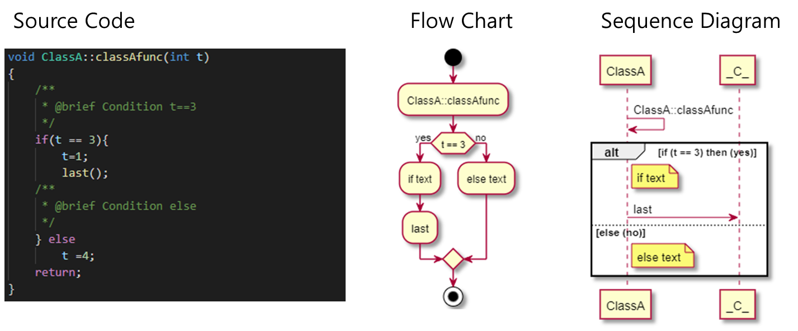
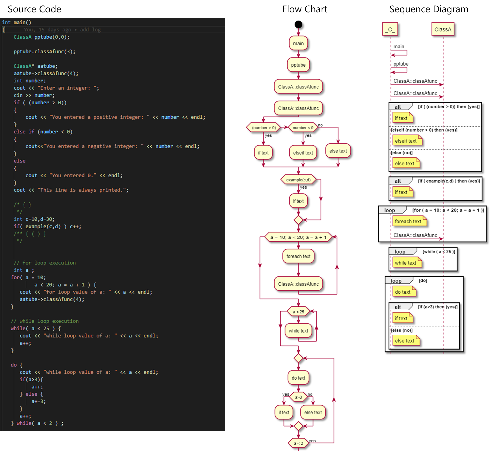
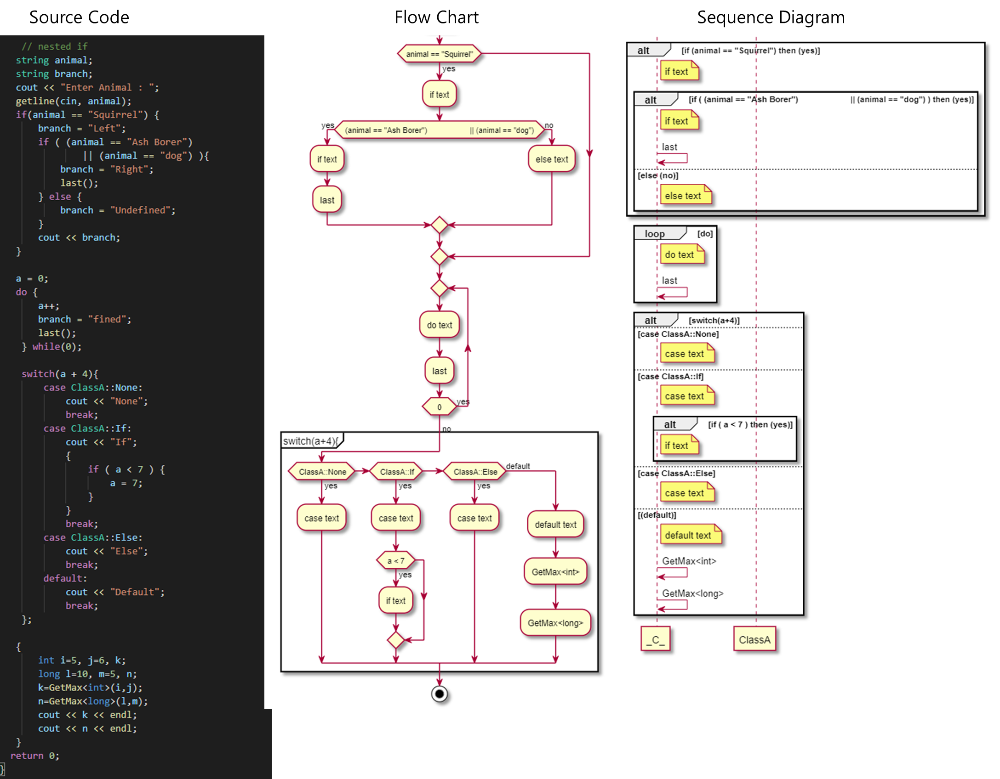

# Draw Flow Chart & Sequence Diagram automatically with plantuml from your source code
- it is not sufficient for doxygen. But , I make this edition (version) briefly to help fast.
- Use this function when you make a flow chart for ASPICE.

# detailed explanation
- https://github.com/cheoljoo/doxygen/blob/FlowChart_SequenceDiagram/src/doxygen_parse.md

## result example [test/a.cpp](https://github.com/cheoljoo/doxygen/blob/FlowChart_SequenceDiagram/test/a.cpp)

- This is auto-generated result ( visual studio code) in function : ClassA::classAfunc() from simple source code.


- if , for , while etc... in function main()


- nested if  in function main()



	- It gives the detailed branch counts (# of test cases) with flow charts.  

## how to run

- doxygen compile 
    - ```git clone -b  FlowChart_SequenceDiagram  https://github.com/cheoljoo/doxygen.git```
    - http://www.doxygen.nl/manual/install.html
      - you can get execute file in doxygen/build/bin
- how to run & test (a.cpp is a similar sample with [examples/flow.cpp](./examples/flow.cpp)  )
  - cd doxygen/test
    - ./doxygen
    - generated result : plantuml.md 
- Try with your code!!!

### how to use it
- cd test
- doxygen
    - a.cpp is examaple
- if you want to use your files.
    - only use cpp file.
    - **but this cpp file should include your headerfile contents.**
``` exmaple.cpp
// header contents
class TT { 
    ...
    A()
};

// cpp contents
TT::A()
{
}
```

## how to show the result (plantuml.md)
- this is plantuml file
- you can show the result with **vcode** or atom editor ( need "markdown preview enhanced" plugin)


## test case 
    - supports nested combination
    - if ~
    - if ~ else
    - if ~ else if ~ else ~
    - for ~
    - while ~
    - do ~ while
    - switch ~ case ~ ...  default ~
    - enum case

### weak point & solution
- do not give proper result
  - ```cpp
    for(;;)
      if (condition)
    ```
    - this is nested if. but , doxygen code.l does not distinguish it. so I can not generate the right result.
    - solution : you use brace for all if as the following
      - ```cpp
    	  for(;;){
          if (condition){
          }
        }
        ```


# relation between flow statement and plantuml
 * @details (c++) switch case default -> (plantuml) if elseif  endif
 * @details (c++) if else     -> (plantuml) if else endif
 * @details (c++) if else if  -> (plantuml) if elseif  endif
 * @details (c++) do while    -> (plantuml) repeat ~ repeat while
 * @details (c++) while       -> (plantuml) while ~ endwhile
 * @details (c++) for         -> (plantuml) while ~ endwhile


# Doxygen
===============
[](https://www.paypal.com/cgi-bin/webscr?cmd=_s-xclick&hosted_button_id=9HHLRBCC8B2B8)

Doxygen is the de facto standard tool for generating documentation from
annotated C++ sources, but it also supports other popular programming
languages such as C, Objective-C, C#, PHP, Java, Python, IDL
(Corba, Microsoft, and UNO/OpenOffice flavors), Fortran, VHDL, Tcl,
and to some extent D.

Doxygen can help you in three ways:

1. It can generate an on-line documentation browser (in HTML) and/or an
   off-line reference manual (in LaTeX) from a set of documented source files.
   There is also support for generating output in RTF (MS-Word), PostScript,
   hyperlinked PDF, compressed HTML, DocBook and Unix man pages.
   The documentation is extracted directly from the sources, which makes
   it much easier to keep the documentation consistent with the source code.
2. You can configure doxygen to extract the code structure from undocumented
   source files. This is very useful to quickly find your way in large
   source distributions. Doxygen can also visualize the relations between
   the various elements by means of include dependency graphs, inheritance
   diagrams, and collaboration diagrams, which are all generated automatically.
3. You can also use doxygen for creating normal documentation (as I did for
   the doxygen user manual and doxygen web-site).

Download
---------
The latest binaries and source of Doxygen can be downloaded from:
* http://www.doxygen.org/

Developers
---------
* Linux & macOS Build Status: <a href="https://travis-ci.org/doxygen/doxygen"></a>
* Windows Build Status: <a href="https://ci.appveyor.com/project/doxygen/doxygen"></a>

* Coverity Scan Build Status: <a href="https://scan.coverity.com/projects/2860">  </a>

* Doxygen's Doxygen Documentation: <a href="https://codedocs.xyz/doxygen/doxygen/"></a>

* Install: Please read the installation section of the manual (http://www.doxygen.org/manual/install.html)

* Project stats: https://www.openhub.net/p/doxygen

Issues, bugs, requests, ideas
----------------------------------
Use the [issue](https://github.com/doxygen/doxygen/issues) tracker to report bugs.

Comms
----------------------------------
### Mailing Lists ###

There are three mailing lists:

* doxygen-announce@lists.sourceforge.net     - Announcement of new releases only
* doxygen-users@lists.sourceforge.net        - for doxygen users
* doxygen-develop@lists.sourceforge.net      - for doxygen developers
* To subscribe follow the link to
    * https://sourceforge.net/projects/doxygen/

Source Code
----------------------------------
In May 2013, Doxygen moved from
subversion to git hosted at GitHub
* https://github.com/doxygen/doxygen

Enjoy,

Dimitri van Heesch (doxygen at gmail.com)
