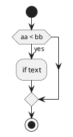

make a plantuml.md file for flow charts

- code.l : 
    - call generating function of plantuml for flow chart : writePlantuml()
- memberdef.h : define flow keyword functions
- memberdef.cpp : 
    - generate plantuml.md file 
    - recursiveProcessPlantuml() is main function to generate flow charts


# weak point:
- do not give proper result
    ```
    if(condition)
        if (condition)
    ```
    - this is nested if. but , doxygen code.l does not distinguish it. so I can not generate the right result.
    - solution : you use brace for all if as the following
    ```
    if(condition){
        if (condition){
        }
    }
    ```

# test case :
    - supports nested combination
    - if ~ 
    - if ~ else 
    - if ~ else if ~ else ~ 
    - for ~
    - while ~
    - do ~ while 
    - switch ~ case ~ ...  default ~
    - enum case

```cpp    
#include <iostream>
#include <string>
using namespace std;

class DerivedA {
public:
    int a ;
    int b ;
    DerivedA(int a=0,int b=0){}
};

class ClassA : public DerivedA {
private:
    int c ;
    int d ;
public:
    enum FF {
        None,
        If,
        Else,
    };
    ClassA(int aa=0,int bb=0):c(aa),d(bb) {} 
    void classAfunc(int t);
};

void ClassA::classAfunc(int t){
    if(t == 3){
        t=1;
    } else 
        t =4;
    return;
}

int example(int& aa,int &bb)
{
	if ( aa < bb ) {
		aa = bb;
	}
	else {
		aa = -bb;
	}

	return aa;
}

int main()
{
    ClassA p(0,0);

   	int number;
    cout << "Enter an integer: ";
    cin >> number;
    if ( (number > 0))
    {
        cout << "You entered a positive integer: " << number << endl;
    }
    else if (number < 0)
    {
        cout<<"You entered a negative integer: " << number << endl;
    }
    else
    {
        cout << "You entered 0." << endl;
    }
    cout << "This line is always printed.";
	
    /* { }
     */
	int c=10,d=30;
	if( example(c,d) ) c++;
    /** { ( ) }
     */


	// for loop execution
    int a ;
   for( a = 10; 
           a < 20; a = a + 1 ) {
      cout << "for loop value of a: " << a << endl;
   }

   // while loop execution
   while( a < 25 ) {
      cout << "while loop value of a: " << a << endl;
      a++;
   }

   do {
      cout << "while loop value of a: " << a << endl;
      if(a>3){
          a++;
      } else {
          a+=3;
      }
      a++;
   } while( a < 2 ) ;

   switch( a ){
       case 1:
           cout << "1" << endl;
           break;
       case 8  :
           cout << "8" << endl;
           break;
        case 3 : 
        case 4 : 
           cout << "1" << endl;
           break;
       default:
           break;
   };


	// nested if
   string animal;
   string branch;
   cout << "Enter Animal : ";
   getline(cin, animal);
   if(animal == "Squirrel") {
	   branch = "Left";
	   if ( (animal == "Ash Borer")
			   || (animal == "dog") ){
		   branch = "Right";
	   } else {
		   branch = "Undefined";
	   }
	   cout << branch;
   }

   a = 0;
   do {
       a++;
	   branch = "fined";
    } while(0);

    switch(a + 4){
        case ClassA::None:
            cout << "None"; 
            break;
        case ClassA::If:
            cout << "If"; 
            break;
        case ClassA::Else:
            cout << "Else"; 
            break;
        default:
            cout << "Default"; 
            break;
    };
}

void last()
{
    int aa =1 , bb = 3;
	if ( aa < bb ) {
		aa = bb;
	}
}
```


## plantuml.md

```puml :func:void classAfunc(int t)
@startuml

	start
  ' IN(-1)
	' {0} [ADDFLOW] func:void classAfunc(int t) ,flow:if ,has:1 ,depth:1 ,file:a.cpp ,line:27 ,cond:(t == 3)
	if (t == 3) then (yes)
		:if text;
	' {1} [ADDFLOW] func:void classAfunc(int t) ,flow:else ,has:0 ,depth:1 ,file:a.cpp ,line:29 ,cond:
	else (no)
		:else text;
	endif
	' {2} [ADDFLOW] func:void classAfunc(int t) ,flow:return ,has:0 ,depth:1 ,file:a.cpp ,line:31 ,cond:
	stop
  ' OUT(-1:2)
@enduml
```

```puml :func:int example(int &aa, int &bb)
@startuml

	start
  ' IN(-1)
	' {0} [ADDFLOW] func:int example(int &aa, int &bb) ,flow:if ,has:1 ,depth:1 ,file:a.cpp ,line:36 ,cond: ( aa < bb )
	if  ( aa < bb ) then (yes)
		:if text;
	' {1} [ADDFLOW] func:int example(int &aa, int &bb) ,flow:else ,has:0 ,depth:1 ,file:a.cpp ,line:39 ,cond:
	else (no)
		:else text;
	endif
	' {2} [ADDFLOW] func:int example(int &aa, int &bb) ,flow:return ,has:0 ,depth:1 ,file:a.cpp ,line:43 ,cond:
	stop
  ' OUT(-1:2)
@enduml
```

```puml :func:int main()
@startuml

	start
  ' IN(-1)
	' {0} [ADDFLOW] func:int main() ,flow:if ,has:1 ,depth:1 ,file:a.cpp ,line:53 ,cond: ( (number > 0))
	if  ( (number > 0)) then (yes)
		:if text;
	' {1} [ADDFLOW] func:int main() ,flow:elseif ,has:1 ,depth:1 ,file:a.cpp ,line:57 ,cond: (number < 0)
	elseif  (number < 0) then (yes)
		:elseif text;
	' {2} [ADDFLOW] func:int main() ,flow:else ,has:0 ,depth:1 ,file:a.cpp ,line:61 ,cond:
	else (no)
		:else text;
	endif
	' {3} [ADDFLOW] func:int main() ,flow:if ,has:1 ,depth:1 ,file:a.cpp ,line:70 ,cond:( example(c,d) )
	if ( example(c,d) ) then (yes)
		:if text;
	endif
	' {4} [ADDFLOW] func:int main() ,flow:for ,has:1 ,depth:1 ,file:a.cpp ,line:77 ,cond:( a = 10;            a < 20; a = a + 1 )
	while ( a = 10;            a < 20; a = a + 1 )
		:for text;
	endwhile
	' {5} [ADDFLOW] func:int main() ,flow:while ,has:1 ,depth:1 ,file:a.cpp ,line:83 ,cond:( a < 25 )
	while ( a < 25 )
		:while text;
	endwhile
	' {6} [ADDFLOW] func:int main() ,flow:do ,has:0 ,depth:1 ,file:a.cpp ,line:88 ,cond:
	repeat
		:do text;
  ' IN(1)
		' {7} [ADDFLOW] func:int main() ,flow:if ,has:1 ,depth:2 ,file:a.cpp ,line:90 ,cond:(a>3)
		if (a>3) then (yes)
			:if text;
		' {8} [ADDFLOW] func:int main() ,flow:else ,has:0 ,depth:2 ,file:a.cpp ,line:92 ,cond:
		else (no)
			:else text;
		endif
  ' OUT(1|8)
	' {9} [ADDFLOW] func:int main() ,flow:while ,has:1 ,depth:1 ,file:a.cpp ,line:96 ,cond:( a < 2 )
	repeat while ( a < 2 ) is (yes)
	->no;
	' {10} [ADDFLOW] func:int main() ,flow:switch ,has:1 ,depth:1 ,file:a.cpp ,line:98 ,cond:( a )
	partition switchT(a){
  ' IN(1)
		' {11} [ADDFLOW] func:int main() ,flow:case ,has:1 ,depth:2 ,file:a.cpp ,line:99 ,cond: 1
		if ( 1) then (yes)
			:case text;
		' {12} [ADDFLOW] func:int main() ,flow:break ,has:0 ,depth:2 ,file:a.cpp ,line:101 ,cond:
		' {13} [ADDFLOW] func:int main() ,flow:case ,has:1 ,depth:2 ,file:a.cpp ,line:102 ,cond: 8  
		elseif ( 8  ) then (yes)
			:case text;
		' {14} [ADDFLOW] func:int main() ,flow:break ,has:0 ,depth:2 ,file:a.cpp ,line:104 ,cond:
		' {15} [ADDFLOW] func:int main() ,flow:case ,has:1 ,depth:2 ,file:a.cpp ,line:105 ,cond: 3 
		elseif ( 3 ) then (yes)
			:case text;
		' {16} [ADDFLOW] func:int main() ,flow:case ,has:1 ,depth:2 ,file:a.cpp ,line:106 ,cond: 4 
		elseif ( 4 ) then (yes)
			:case text;
		' {17} [ADDFLOW] func:int main() ,flow:break ,has:0 ,depth:2 ,file:a.cpp ,line:108 ,cond:
		' {18} [ADDFLOW] func:int main() ,flow:default ,has:0 ,depth:2 ,file:a.cpp ,line:109 ,cond:
		else (default)
			:default text;
		' {19} [ADDFLOW] func:int main() ,flow:break ,has:0 ,depth:2 ,file:a.cpp ,line:110 ,cond:
  ' OUT(1|19)
		endif
	}
	' {20} [ADDFLOW] func:int main() ,flow:if ,has:1 ,depth:1 ,file:a.cpp ,line:119 ,cond:(animal == "Squirrel")
	if (animal == "Squirrel") then (yes)
		:if text;
  ' IN(1)
		' {21} [ADDFLOW] func:int main() ,flow:if ,has:1 ,depth:2 ,file:a.cpp ,line:121 ,cond: ( (animal == "Ash Borer")			   || (animal == "dog") )
		if  ( (animal == "Ash Borer")			   || (animal == "dog") ) then (yes)
			:if text;
		' {22} [ADDFLOW] func:int main() ,flow:else ,has:0 ,depth:2 ,file:a.cpp ,line:124 ,cond:
		else (no)
			:else text;
		endif
  ' OUT(1|22)
	endif
	' {23} [ADDFLOW] func:int main() ,flow:do ,has:0 ,depth:1 ,file:a.cpp ,line:131 ,cond:
	repeat
		:do text;
	' {24} [ADDFLOW] func:int main() ,flow:while ,has:1 ,depth:1 ,file:a.cpp ,line:134 ,cond:(0)
	repeat while (0) is (yes)
	->no;
	' {25} [ADDFLOW] func:int main() ,flow:switch ,has:1 ,depth:1 ,file:a.cpp ,line:136 ,cond:(a + 4)
	partition switchT(a+4){
  ' IN(1)
		' {26} [ADDFLOW] func:int main() ,flow:case ,has:1 ,depth:2 ,file:a.cpp ,line:137 ,cond: ClassA::None
		if ( ClassA::None) then (yes)
			:case text;
		' {27} [ADDFLOW] func:int main() ,flow:break ,has:0 ,depth:2 ,file:a.cpp ,line:139 ,cond:
		' {28} [ADDFLOW] func:int main() ,flow:case ,has:1 ,depth:2 ,file:a.cpp ,line:140 ,cond: ClassA::If
		elseif ( ClassA::If) then (yes)
			:case text;
		' {29} [ADDFLOW] func:int main() ,flow:break ,has:0 ,depth:2 ,file:a.cpp ,line:142 ,cond:
		' {30} [ADDFLOW] func:int main() ,flow:case ,has:1 ,depth:2 ,file:a.cpp ,line:143 ,cond: ClassA::Else
		elseif ( ClassA::Else) then (yes)
			:case text;
		' {31} [ADDFLOW] func:int main() ,flow:break ,has:0 ,depth:2 ,file:a.cpp ,line:145 ,cond:
		' {32} [ADDFLOW] func:int main() ,flow:default ,has:0 ,depth:2 ,file:a.cpp ,line:146 ,cond:
		else (default)
			:default text;
		' {33} [ADDFLOW] func:int main() ,flow:break ,has:0 ,depth:2 ,file:a.cpp ,line:148 ,cond:
  ' OUT(1:33)
		endif
	}
  ' OUT(-1:4096)
	stop
@enduml
```












