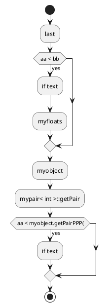
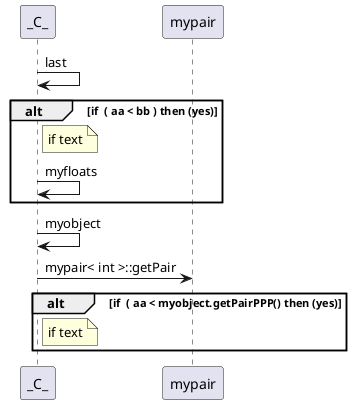

```puml :func-FlowChart:T GetMax(T a, T b)
@startuml

' test mypair< int >
' test mypair
' test mypair 
' test A::B<S>
' test A::B
	start
  ' IN(depth:-1,index:0)
' {0} [ADDFLOW] func:T GetMax(T a, T b) ,flow:functioncall ,loopflow:0 ,has:1 ,depth:0 ,file:a.cpp ,line:24 ,cond:GetMax
:GetMax;
	' {1} [ADDFLOW] func:T GetMax(T a, T b) ,flow:return ,loopflow:13 ,has:0 ,depth:1 ,file:a.cpp ,line:27 ,cond:
	stop
  ' OUT(depth:-1:index:1)
@enduml
```

```puml :func-SequenceDiagram:T GetMax(T a, T b)
@startuml

  ' IN(depth:-1,index:0)
' {0} [ADDFLOW] func:T GetMax(T a, T b) ,flow:functioncall ,loopflow:0 ,has:1 ,depth:0 ,file:a.cpp ,line:24 ,cond:GetMax
_C_ -> _C_:GetMax
	' {1} [ADDFLOW] func:T GetMax(T a, T b) ,flow:return ,loopflow:13 ,has:0 ,depth:1 ,file:a.cpp ,line:27 ,cond:
  ' OUT(depth:-1:index:1)
@enduml
```

```puml :func-FlowChart:ClassA(int aa=0, int bb=0)
@startuml

' test mypair< int >
' test mypair
' test mypair 
' test A::B<S>
' test A::B
	start
  ' IN(depth:-1,index:0)
' {0} [ADDFLOW] func:ClassA(int aa=0, int bb=0) ,flow:functioncall ,loopflow:0 ,has:1 ,depth:0 ,file:a.cpp ,line:52 ,cond:ClassA
:ClassA;
	' {1} [ADDFLOW] func:ClassA(int aa=0, int bb=0) ,flow:functioncall ,loopflow:13 ,has:1 ,depth:1 ,file:a.cpp ,line:53 ,cond:derivedB
	:derivedB;
	' {2} [ADDFLOW] func:ClassA(int aa=0, int bb=0) ,flow:functioncall ,loopflow:13 ,has:1 ,depth:1 ,file:a.cpp ,line:54 ,cond:last
	:last;
  ' OUT(depth:-1:index:2)
	stop
@enduml
```

```puml :func-SequenceDiagram:ClassA(int aa=0, int bb=0)
@startuml

participant ClassA
  ' IN(depth:-1,index:0)
' {0} [ADDFLOW] func:ClassA(int aa=0, int bb=0) ,flow:functioncall ,loopflow:0 ,has:1 ,depth:0 ,file:a.cpp ,line:52 ,cond:ClassA
' function : ClassA is a mmeber function of ClassA class.
ClassA -> ClassA:ClassA
	' {1} [ADDFLOW] func:ClassA(int aa=0, int bb=0) ,flow:functioncall ,loopflow:13 ,has:1 ,depth:1 ,file:a.cpp ,line:53 ,cond:derivedB
	' function : derivedB is a mmeber function of ClassA class.
	ClassA -> ClassA:derivedB
	' {2} [ADDFLOW] func:ClassA(int aa=0, int bb=0) ,flow:functioncall ,loopflow:13 ,has:1 ,depth:1 ,file:a.cpp ,line:54 ,cond:last
	' function : last is not member function of ClassA class.
	ClassA -> _C_:last
  ' OUT(depth:-1:index:2)
@enduml
```

```puml :func-FlowChart:void classAfunc(int t)
@startuml

' test mypair< int >
' test mypair
' test mypair 
' test A::B<S>
' test A::B
	start
  ' IN(depth:-1,index:0)
' {0} [ADDFLOW] func:void classAfunc(int t) ,flow:functioncall ,loopflow:0 ,has:1 ,depth:0 ,file:a.cpp ,line:92 ,cond:ClassA::classAfunc
:ClassA::classAfunc;
	' {1} [ADDFLOW] func:void classAfunc(int t) ,flow:if ,loopflow:13 ,has:1 ,depth:1 ,file:a.cpp ,line:97 ,cond:(t == 3)
	if (t == 3) then (yes)
		:if text;
  ' IN(depth:1,index:2)
		' {2} [ADDFLOW] func:void classAfunc(int t) ,flow:functioncall ,loopflow:0 ,has:1 ,depth:2 ,file:a.cpp ,line:99 ,cond:last
		:last;
  ' OUT(depth:1<index:2)
	' {3} [ADDFLOW] func:void classAfunc(int t) ,flow:else ,loopflow:10 ,has:0 ,depth:1 ,file:a.cpp ,line:103 ,cond:
	else (no)
		:else text;
	endif
	' {4} [ADDFLOW] func:void classAfunc(int t) ,flow:return ,loopflow:10 ,has:0 ,depth:1 ,file:a.cpp ,line:105 ,cond:
	stop
  ' OUT(depth:-1:index:4)
@enduml
```

```puml :func-SequenceDiagram:void classAfunc(int t)
@startuml

participant ClassA
  ' IN(depth:-1,index:0)
' {0} [ADDFLOW] func:void classAfunc(int t) ,flow:functioncall ,loopflow:0 ,has:1 ,depth:0 ,file:a.cpp ,line:92 ,cond:ClassA::classAfunc
' function ClassA::classAfunc is class member function.
ClassA -> ClassA:ClassA::classAfunc
	' {1} [ADDFLOW] func:void classAfunc(int t) ,flow:if ,loopflow:13 ,has:1 ,depth:1 ,file:a.cpp ,line:97 ,cond:(t == 3)
	alt if (t == 3) then (yes)
		note right of ClassA :if text
  ' IN(depth:1,index:2)
		' {2} [ADDFLOW] func:void classAfunc(int t) ,flow:functioncall ,loopflow:0 ,has:1 ,depth:2 ,file:a.cpp ,line:99 ,cond:last
		' function : last is not member function of ClassA class.
		ClassA -> _C_:last
  ' OUT(depth:1<index:2)
	' {3} [ADDFLOW] func:void classAfunc(int t) ,flow:else ,loopflow:10 ,has:0 ,depth:1 ,file:a.cpp ,line:103 ,cond:
	else else (no)
		note right of ClassA :else text
	end
	' {4} [ADDFLOW] func:void classAfunc(int t) ,flow:return ,loopflow:10 ,has:0 ,depth:1 ,file:a.cpp ,line:105 ,cond:
  ' OUT(depth:-1:index:4)
@enduml
```

```puml :func-FlowChart:int example(int &aa, int &bb)
@startuml

' test mypair< int >
' test mypair
' test mypair 
' test A::B<S>
' test A::B
	start
  ' IN(depth:-1,index:0)
' {0} [ADDFLOW] func:int example(int &aa, int &bb) ,flow:functioncall ,loopflow:0 ,has:1 ,depth:0 ,file:a.cpp ,line:120 ,cond:example
:example;
	' {1} [ADDFLOW] func:int example(int &aa, int &bb) ,flow:if ,loopflow:13 ,has:1 ,depth:1 ,file:a.cpp ,line:122 ,cond: ( aa < bb )
	if  ( aa < bb ) then (yes)
		:if text;
	' {2} [ADDFLOW] func:int example(int &aa, int &bb) ,flow:else ,loopflow:10 ,has:0 ,depth:1 ,file:a.cpp ,line:125 ,cond:
	else (no)
		:else text;
  ' IN(depth:1,index:3)
		' {3} [ADDFLOW] func:int example(int &aa, int &bb) ,flow:functioncall ,loopflow:0 ,has:1 ,depth:2 ,file:a.cpp ,line:127 ,cond:ClassA::classAfunc
		:ClassA::classAfunc;
  ' OUT(depth:1<index:3)
	endif
	' {4} [ADDFLOW] func:int example(int &aa, int &bb) ,flow:return ,loopflow:10 ,has:0 ,depth:1 ,file:a.cpp ,line:130 ,cond:
	stop
  ' OUT(depth:-1:index:4)
@enduml
```

```puml :func-SequenceDiagram:int example(int &aa, int &bb)
@startuml

  ' IN(depth:-1,index:0)
' {0} [ADDFLOW] func:int example(int &aa, int &bb) ,flow:functioncall ,loopflow:0 ,has:1 ,depth:0 ,file:a.cpp ,line:120 ,cond:example
_C_ -> _C_:example
	' {1} [ADDFLOW] func:int example(int &aa, int &bb) ,flow:if ,loopflow:13 ,has:1 ,depth:1 ,file:a.cpp ,line:122 ,cond: ( aa < bb )
	alt if  ( aa < bb ) then (yes)
		note right of _C_ :if text
	' {2} [ADDFLOW] func:int example(int &aa, int &bb) ,flow:else ,loopflow:10 ,has:0 ,depth:1 ,file:a.cpp ,line:125 ,cond:
	else else (no)
		note right of _C_ :else text
  ' IN(depth:1,index:3)
		' {3} [ADDFLOW] func:int example(int &aa, int &bb) ,flow:functioncall ,loopflow:0 ,has:1 ,depth:2 ,file:a.cpp ,line:127 ,cond:ClassA::classAfunc
		' function ClassA::classAfunc is class member function.
		_C_ -> ClassA:ClassA::classAfunc
  ' OUT(depth:1<index:3)
	end
	' {4} [ADDFLOW] func:int example(int &aa, int &bb) ,flow:return ,loopflow:10 ,has:0 ,depth:1 ,file:a.cpp ,line:130 ,cond:
  ' OUT(depth:-1:index:4)
@enduml
```

```puml :func-FlowChart:int main()
@startuml

' test mypair< int >
' test mypair
' test mypair 
' test A::B<S>
' test A::B
	start
  ' IN(depth:-1,index:0)
' {0} [ADDFLOW] func:int main() ,flow:functioncall ,loopflow:0 ,has:1 ,depth:0 ,file:a.cpp ,line:133 ,cond:main
:main;
	' {1} [ADDFLOW] func:int main() ,flow:functioncall ,loopflow:13 ,has:1 ,depth:1 ,file:a.cpp ,line:135 ,cond:pptube
	:pptube;
	' {2} [ADDFLOW] func:int main() ,flow:functioncall ,loopflow:13 ,has:1 ,depth:1 ,file:a.cpp ,line:137 ,cond:ClassA::classAfunc
	:ClassA::classAfunc;
	' {3} [ADDFLOW] func:int main() ,flow:functioncall ,loopflow:13 ,has:1 ,depth:1 ,file:a.cpp ,line:140 ,cond:ClassA::classAfunc
	:ClassA::classAfunc;
	' {4} [ADDFLOW] func:int main() ,flow:if ,loopflow:13 ,has:1 ,depth:1 ,file:a.cpp ,line:144 ,cond: ( (number > 0))
	if  ( (number > 0)) then (yes)
		:if text;
	' {5} [ADDFLOW] func:int main() ,flow:elseif ,loopflow:10 ,has:1 ,depth:1 ,file:a.cpp ,line:148 ,cond: (number < 0)
	elseif  (number < 0) then (yes)
		:elseif text;
	' {6} [ADDFLOW] func:int main() ,flow:else ,loopflow:10 ,has:0 ,depth:1 ,file:a.cpp ,line:152 ,cond:
	else (no)
		:else text;
	endif
	' {7} [ADDFLOW] func:int main() ,flow:if ,loopflow:10 ,has:1 ,depth:1 ,file:a.cpp ,line:161 ,cond:( example(c,d) )
	if ( example(c,d) ) then (yes)
		:if text;
	endif
	' {8} [ADDFLOW] func:int main() ,flow:for ,loopflow:10 ,has:1 ,depth:1 ,file:a.cpp ,line:168 ,cond:( a = 10;            a < 20; a = a + 1 )
	while ( a = 10;            a < 20; a = a + 1 )
		:foreach text;
  ' IN(depth:1,index:9)
		' {9} [ADDFLOW] func:int main() ,flow:functioncall ,loopflow:0 ,has:1 ,depth:2 ,file:a.cpp ,line:171 ,cond:ClassA::classAfunc
		:ClassA::classAfunc;
  ' OUT(depth:1<index:9)
	endwhile
	' {10} [ADDFLOW] func:int main() ,flow:while ,loopflow:8 ,has:1 ,depth:1 ,file:a.cpp ,line:175 ,cond:( a < 25 )
	while ( a < 25 )
		:while text;
	endwhile
	' {11} [ADDFLOW] func:int main() ,flow:do ,loopflow:11 ,has:0 ,depth:1 ,file:a.cpp ,line:180 ,cond:
	repeat
		:do text;
  ' IN(depth:1,index:12)
		' {12} [ADDFLOW] func:int main() ,flow:if ,loopflow:0 ,has:1 ,depth:2 ,file:a.cpp ,line:182 ,cond:(a>3)
		if (a>3) then (yes)
			:if text;
		' {13} [ADDFLOW] func:int main() ,flow:else ,loopflow:10 ,has:0 ,depth:2 ,file:a.cpp ,line:184 ,cond:
		else (no)
			:else text;
		endif
  ' OUT(depth:1<index:13)
	' {14} [ADDFLOW] func:int main() ,flow:while ,loopflow:3 ,has:1 ,depth:1 ,file:a.cpp ,line:188 ,cond:( a < 2 )
	repeat while ( a < 2 ) is (yes)
	->no;
	' {15} [ADDFLOW] func:int main() ,flow:switch ,loopflow:11 ,has:1 ,depth:1 ,file:a.cpp ,line:190 ,cond:( a )
	partition switch(a){
  ' IN(depth:1,index:16)
		' {16} [ADDFLOW] func:int main() ,flow:case ,loopflow:0 ,has:1 ,depth:2 ,file:a.cpp ,line:191 ,cond: 1
		if ( 1) then (yes)
			:case text;
		' {17} [ADDFLOW] func:int main() ,flow:break ,loopflow:0 ,has:0 ,depth:2 ,file:a.cpp ,line:193 ,cond:
		' {18} [ADDFLOW] func:int main() ,flow:case ,loopflow:0 ,has:1 ,depth:2 ,file:a.cpp ,line:194 ,cond: 8  
		elseif ( 8  ) then (yes)
			:case text;
		' {19} [ADDFLOW] func:int main() ,flow:break ,loopflow:0 ,has:0 ,depth:2 ,file:a.cpp ,line:196 ,cond:
		' {20} [ADDFLOW] func:int main() ,flow:case ,loopflow:0 ,has:1 ,depth:2 ,file:a.cpp ,line:197 ,cond: 3 
		elseif ( 3 ) then (yes)
			:case text;
		' {21} [ADDFLOW] func:int main() ,flow:case ,loopflow:0 ,has:1 ,depth:2 ,file:a.cpp ,line:198 ,cond: 4 
		elseif ( 4 ) then (yes)
			:case text;
		' {22} [ADDFLOW] func:int main() ,flow:break ,loopflow:0 ,has:0 ,depth:2 ,file:a.cpp ,line:200 ,cond:
		' {23} [ADDFLOW] func:int main() ,flow:default ,loopflow:0 ,has:0 ,depth:2 ,file:a.cpp ,line:201 ,cond:
		else (default)
			:default text;
		' {24} [ADDFLOW] func:int main() ,flow:break ,loopflow:0 ,has:0 ,depth:2 ,file:a.cpp ,line:202 ,cond:
  ' OUT(depth:1<index:24)
		endif
	}
	' {25} [ADDFLOW] func:int main() ,flow:functioncall ,loopflow:6 ,has:1 ,depth:1 ,file:a.cpp ,line:210 ,cond:getline
	:getline;
	' {26} [ADDFLOW] func:int main() ,flow:if ,loopflow:13 ,has:1 ,depth:1 ,file:a.cpp ,line:211 ,cond:(animal == "Squirrel")
	if (animal == "Squirrel") then (yes)
		:if text;
  ' IN(depth:1,index:27)
		' {27} [ADDFLOW] func:int main() ,flow:if ,loopflow:0 ,has:1 ,depth:2 ,file:a.cpp ,line:213 ,cond: ( (animal == "Ash Borer")			   || (animal == "dog") )
		if  ( (animal == "Ash Borer")			   || (animal == "dog") ) then (yes)
			:if text;
  ' IN(depth:2,index:28)
			' {28} [ADDFLOW] func:int main() ,flow:functioncall ,loopflow:0 ,has:1 ,depth:3 ,file:a.cpp ,line:216 ,cond:last
			:last;
  ' OUT(depth:2<index:28)
		' {29} [ADDFLOW] func:int main() ,flow:else ,loopflow:10 ,has:0 ,depth:2 ,file:a.cpp ,line:217 ,cond:
		else (no)
			:else text;
		endif
  ' OUT(depth:1<index:29)
	endif
	' {30} [ADDFLOW] func:int main() ,flow:do ,loopflow:10 ,has:0 ,depth:1 ,file:a.cpp ,line:224 ,cond:
	repeat
		:do text;
  ' IN(depth:1,index:31)
		' {31} [ADDFLOW] func:int main() ,flow:functioncall ,loopflow:0 ,has:1 ,depth:2 ,file:a.cpp ,line:227 ,cond:last
		:last;
  ' OUT(depth:1<index:31)
	' {32} [ADDFLOW] func:int main() ,flow:while ,loopflow:3 ,has:1 ,depth:1 ,file:a.cpp ,line:228 ,cond:(0)
	repeat while (0) is (yes)
	->no;
	' {33} [ADDFLOW] func:int main() ,flow:switch ,loopflow:11 ,has:1 ,depth:1 ,file:a.cpp ,line:230 ,cond:(a + 4)
	partition switch(a+4){
  ' IN(depth:1,index:34)
		' {34} [ADDFLOW] func:int main() ,flow:case ,loopflow:0 ,has:1 ,depth:2 ,file:a.cpp ,line:231 ,cond: ClassA::None
		if ( ClassA::None) then (yes)
			:case text;
		' {35} [ADDFLOW] func:int main() ,flow:break ,loopflow:0 ,has:0 ,depth:2 ,file:a.cpp ,line:233 ,cond:
		' {36} [ADDFLOW] func:int main() ,flow:case ,loopflow:0 ,has:1 ,depth:2 ,file:a.cpp ,line:234 ,cond: ClassA::If
		elseif ( ClassA::If) then (yes)
			:case text;
  ' IN(depth:2,index:37)
			' {37} [ADDFLOW] func:int main() ,flow:if ,loopflow:0 ,has:1 ,depth:3 ,file:a.cpp ,line:237 ,cond: ( a < 7 )
			if  ( a < 7 ) then (yes)
				:if text;
			endif
  ' OUT(depth:2<index:37)
		' {38} [ADDFLOW] func:int main() ,flow:break ,loopflow:0 ,has:0 ,depth:2 ,file:a.cpp ,line:241 ,cond:
		' {39} [ADDFLOW] func:int main() ,flow:case ,loopflow:0 ,has:1 ,depth:2 ,file:a.cpp ,line:242 ,cond: ClassA::Else
		elseif ( ClassA::Else) then (yes)
			:case text;
		' {40} [ADDFLOW] func:int main() ,flow:break ,loopflow:0 ,has:0 ,depth:2 ,file:a.cpp ,line:244 ,cond:
		' {41} [ADDFLOW] func:int main() ,flow:default ,loopflow:0 ,has:0 ,depth:2 ,file:a.cpp ,line:245 ,cond:
		else (default)
			:default text;
		' {42} [ADDFLOW] func:int main() ,flow:break ,loopflow:0 ,has:0 ,depth:2 ,file:a.cpp ,line:247 ,cond:
		' {43} [ADDFLOW] func:int main() ,flow:functioncall ,loopflow:0 ,has:1 ,depth:2 ,file:a.cpp ,line:253 ,cond:GetMax<int>
		:GetMax<int>;
		' {44} [ADDFLOW] func:int main() ,flow:functioncall ,loopflow:13 ,has:1 ,depth:2 ,file:a.cpp ,line:254 ,cond:GetMax<long>
		:GetMax<long>;
  ' OUT(depth:1<index:44)
		endif
	}
	' {45} [ADDFLOW] func:int main() ,flow:return ,loopflow:6 ,has:0 ,depth:1 ,file:a.cpp ,line:258 ,cond:
	stop
  ' OUT(depth:-1:index:45)
@enduml
```

```puml :func-SequenceDiagram:int main()
@startuml

  ' IN(depth:-1,index:0)
' {0} [ADDFLOW] func:int main() ,flow:functioncall ,loopflow:0 ,has:1 ,depth:0 ,file:a.cpp ,line:133 ,cond:main
_C_ -> _C_:main
	' {1} [ADDFLOW] func:int main() ,flow:functioncall ,loopflow:13 ,has:1 ,depth:1 ,file:a.cpp ,line:135 ,cond:pptube
	_C_ -> _C_:pptube
	' {2} [ADDFLOW] func:int main() ,flow:functioncall ,loopflow:13 ,has:1 ,depth:1 ,file:a.cpp ,line:137 ,cond:ClassA::classAfunc
	' function ClassA::classAfunc is class member function.
	_C_ -> ClassA:ClassA::classAfunc
	' {3} [ADDFLOW] func:int main() ,flow:functioncall ,loopflow:13 ,has:1 ,depth:1 ,file:a.cpp ,line:140 ,cond:ClassA::classAfunc
	' function ClassA::classAfunc is class member function.
	_C_ -> ClassA:ClassA::classAfunc
	' {4} [ADDFLOW] func:int main() ,flow:if ,loopflow:13 ,has:1 ,depth:1 ,file:a.cpp ,line:144 ,cond: ( (number > 0))
	alt if  ( (number > 0)) then (yes)
		note right of _C_ :if text
	' {5} [ADDFLOW] func:int main() ,flow:elseif ,loopflow:10 ,has:1 ,depth:1 ,file:a.cpp ,line:148 ,cond: (number < 0)
	else elseif  (number < 0) then (yes)
		note right of _C_ :elseif text
	' {6} [ADDFLOW] func:int main() ,flow:else ,loopflow:10 ,has:0 ,depth:1 ,file:a.cpp ,line:152 ,cond:
	else else (no)
		note right of _C_ :else text
	end
	' {7} [ADDFLOW] func:int main() ,flow:if ,loopflow:10 ,has:1 ,depth:1 ,file:a.cpp ,line:161 ,cond:( example(c,d) )
	alt if ( example(c,d) ) then (yes)
		note right of _C_ :if text
	end
	' {8} [ADDFLOW] func:int main() ,flow:for ,loopflow:10 ,has:1 ,depth:1 ,file:a.cpp ,line:168 ,cond:( a = 10;            a < 20; a = a + 1 )
	loop for ( a = 10;            a < 20; a = a + 1 )
		note right of _C_ :foreach text
  ' IN(depth:1,index:9)
		' {9} [ADDFLOW] func:int main() ,flow:functioncall ,loopflow:0 ,has:1 ,depth:2 ,file:a.cpp ,line:171 ,cond:ClassA::classAfunc
		' function ClassA::classAfunc is class member function.
		_C_ -> ClassA:ClassA::classAfunc
  ' OUT(depth:1<index:9)
	end
	' {10} [ADDFLOW] func:int main() ,flow:while ,loopflow:8 ,has:1 ,depth:1 ,file:a.cpp ,line:175 ,cond:( a < 25 )
	loop while ( a < 25 )
		note right of _C_ :while text
	end
	' {11} [ADDFLOW] func:int main() ,flow:do ,loopflow:11 ,has:0 ,depth:1 ,file:a.cpp ,line:180 ,cond:
	loop do
		note right of _C_ :do text
  ' IN(depth:1,index:12)
		' {12} [ADDFLOW] func:int main() ,flow:if ,loopflow:0 ,has:1 ,depth:2 ,file:a.cpp ,line:182 ,cond:(a>3)
		alt if (a>3) then (yes)
			note right of _C_ :if text
		' {13} [ADDFLOW] func:int main() ,flow:else ,loopflow:10 ,has:0 ,depth:2 ,file:a.cpp ,line:184 ,cond:
		else else (no)
			note right of _C_ :else text
		end
  ' OUT(depth:1<index:13)
	' {14} [ADDFLOW] func:int main() ,flow:while ,loopflow:3 ,has:1 ,depth:1 ,file:a.cpp ,line:188 ,cond:( a < 2 )
	end
	' {15} [ADDFLOW] func:int main() ,flow:switch ,loopflow:11 ,has:1 ,depth:1 ,file:a.cpp ,line:190 ,cond:( a )
	alt switch(a)
  ' IN(depth:1,index:16)
		' {16} [ADDFLOW] func:int main() ,flow:case ,loopflow:0 ,has:1 ,depth:2 ,file:a.cpp ,line:191 ,cond: 1
		else case  1
			note right of _C_ :case text
		' {17} [ADDFLOW] func:int main() ,flow:break ,loopflow:0 ,has:0 ,depth:2 ,file:a.cpp ,line:193 ,cond:
		' {18} [ADDFLOW] func:int main() ,flow:case ,loopflow:0 ,has:1 ,depth:2 ,file:a.cpp ,line:194 ,cond: 8  
		else case  8  
			note right of _C_ :case text
		' {19} [ADDFLOW] func:int main() ,flow:break ,loopflow:0 ,has:0 ,depth:2 ,file:a.cpp ,line:196 ,cond:
		' {20} [ADDFLOW] func:int main() ,flow:case ,loopflow:0 ,has:1 ,depth:2 ,file:a.cpp ,line:197 ,cond: 3 
		else case  3 
			note right of _C_ :case text
		' {21} [ADDFLOW] func:int main() ,flow:case ,loopflow:0 ,has:1 ,depth:2 ,file:a.cpp ,line:198 ,cond: 4 
		else case  4 
			note right of _C_ :case text
		' {22} [ADDFLOW] func:int main() ,flow:break ,loopflow:0 ,has:0 ,depth:2 ,file:a.cpp ,line:200 ,cond:
		' {23} [ADDFLOW] func:int main() ,flow:default ,loopflow:0 ,has:0 ,depth:2 ,file:a.cpp ,line:201 ,cond:
		else (default)
			note right of _C_ : default text
		' {24} [ADDFLOW] func:int main() ,flow:break ,loopflow:0 ,has:0 ,depth:2 ,file:a.cpp ,line:202 ,cond:
  ' OUT(depth:1<index:24)
		end
	' {25} [ADDFLOW] func:int main() ,flow:functioncall ,loopflow:6 ,has:1 ,depth:1 ,file:a.cpp ,line:210 ,cond:getline
	_C_ -> _C_:getline
	' {26} [ADDFLOW] func:int main() ,flow:if ,loopflow:13 ,has:1 ,depth:1 ,file:a.cpp ,line:211 ,cond:(animal == "Squirrel")
	alt if (animal == "Squirrel") then (yes)
		note right of _C_ :if text
  ' IN(depth:1,index:27)
		' {27} [ADDFLOW] func:int main() ,flow:if ,loopflow:0 ,has:1 ,depth:2 ,file:a.cpp ,line:213 ,cond: ( (animal == "Ash Borer")			   || (animal == "dog") )
		alt if  ( (animal == "Ash Borer")			   || (animal == "dog") ) then (yes)
			note right of _C_ :if text
  ' IN(depth:2,index:28)
			' {28} [ADDFLOW] func:int main() ,flow:functioncall ,loopflow:0 ,has:1 ,depth:3 ,file:a.cpp ,line:216 ,cond:last
			_C_ -> _C_:last
  ' OUT(depth:2<index:28)
		' {29} [ADDFLOW] func:int main() ,flow:else ,loopflow:10 ,has:0 ,depth:2 ,file:a.cpp ,line:217 ,cond:
		else else (no)
			note right of _C_ :else text
		end
  ' OUT(depth:1<index:29)
	end
	' {30} [ADDFLOW] func:int main() ,flow:do ,loopflow:10 ,has:0 ,depth:1 ,file:a.cpp ,line:224 ,cond:
	loop do
		note right of _C_ :do text
  ' IN(depth:1,index:31)
		' {31} [ADDFLOW] func:int main() ,flow:functioncall ,loopflow:0 ,has:1 ,depth:2 ,file:a.cpp ,line:227 ,cond:last
		_C_ -> _C_:last
  ' OUT(depth:1<index:31)
	' {32} [ADDFLOW] func:int main() ,flow:while ,loopflow:3 ,has:1 ,depth:1 ,file:a.cpp ,line:228 ,cond:(0)
	end
	' {33} [ADDFLOW] func:int main() ,flow:switch ,loopflow:11 ,has:1 ,depth:1 ,file:a.cpp ,line:230 ,cond:(a + 4)
	alt switch(a+4)
  ' IN(depth:1,index:34)
		' {34} [ADDFLOW] func:int main() ,flow:case ,loopflow:0 ,has:1 ,depth:2 ,file:a.cpp ,line:231 ,cond: ClassA::None
		else case  ClassA::None
			note right of _C_ :case text
		' {35} [ADDFLOW] func:int main() ,flow:break ,loopflow:0 ,has:0 ,depth:2 ,file:a.cpp ,line:233 ,cond:
		' {36} [ADDFLOW] func:int main() ,flow:case ,loopflow:0 ,has:1 ,depth:2 ,file:a.cpp ,line:234 ,cond: ClassA::If
		else case  ClassA::If
			note right of _C_ :case text
  ' IN(depth:2,index:37)
			' {37} [ADDFLOW] func:int main() ,flow:if ,loopflow:0 ,has:1 ,depth:3 ,file:a.cpp ,line:237 ,cond: ( a < 7 )
			alt if  ( a < 7 ) then (yes)
				note right of _C_ :if text
			end
  ' OUT(depth:2<index:37)
		' {38} [ADDFLOW] func:int main() ,flow:break ,loopflow:0 ,has:0 ,depth:2 ,file:a.cpp ,line:241 ,cond:
		' {39} [ADDFLOW] func:int main() ,flow:case ,loopflow:0 ,has:1 ,depth:2 ,file:a.cpp ,line:242 ,cond: ClassA::Else
		else case  ClassA::Else
			note right of _C_ :case text
		' {40} [ADDFLOW] func:int main() ,flow:break ,loopflow:0 ,has:0 ,depth:2 ,file:a.cpp ,line:244 ,cond:
		' {41} [ADDFLOW] func:int main() ,flow:default ,loopflow:0 ,has:0 ,depth:2 ,file:a.cpp ,line:245 ,cond:
		else (default)
			note right of _C_ : default text
		' {42} [ADDFLOW] func:int main() ,flow:break ,loopflow:0 ,has:0 ,depth:2 ,file:a.cpp ,line:247 ,cond:
		' {43} [ADDFLOW] func:int main() ,flow:functioncall ,loopflow:0 ,has:1 ,depth:2 ,file:a.cpp ,line:253 ,cond:GetMax<int>
		_C_ -> _C_:GetMax<int>
		' {44} [ADDFLOW] func:int main() ,flow:functioncall ,loopflow:13 ,has:1 ,depth:2 ,file:a.cpp ,line:254 ,cond:GetMax<long>
		_C_ -> _C_:GetMax<long>
  ' OUT(depth:1<index:44)
		end
	' {45} [ADDFLOW] func:int main() ,flow:return ,loopflow:6 ,has:0 ,depth:1 ,file:a.cpp ,line:258 ,cond:
  ' OUT(depth:-1:index:45)
@enduml
```

```puml :func-FlowChart:T getPair()
@startuml

' test mypair< int >
' test mypair
' test mypair 
' test A::B<S>
' test A::B
	start
  ' IN(depth:-1,index:0)
' {0} [ADDFLOW] func:T getPair() ,flow:functioncall ,loopflow:0 ,has:1 ,depth:0 ,file:a.cpp ,line:269 ,cond:getPair
:getPair;
	' {1} [ADDFLOW] func:T getPair() ,flow:return ,loopflow:13 ,has:0 ,depth:1 ,file:a.cpp ,line:269 ,cond:
	stop
  ' OUT(depth:-1:index:1)
@enduml
```

```puml :func-SequenceDiagram:T getPair()
@startuml

participant mypair
  ' IN(depth:-1,index:0)
' {0} [ADDFLOW] func:T getPair() ,flow:functioncall ,loopflow:0 ,has:1 ,depth:0 ,file:a.cpp ,line:269 ,cond:getPair
' function : getPair is a mmeber function of mypair class.
mypair -> mypair:getPair
	' {1} [ADDFLOW] func:T getPair() ,flow:return ,loopflow:13 ,has:0 ,depth:1 ,file:a.cpp ,line:269 ,cond:
  ' OUT(depth:-1:index:1)
@enduml
```

```puml :func-FlowChart:void last()
@startuml

' test mypair< int >
' test mypair
' test mypair 
' test A::B<S>
' test A::B
	start
  ' IN(depth:-1,index:0)
' {0} [ADDFLOW] func:void last() ,flow:functioncall ,loopflow:0 ,has:1 ,depth:0 ,file:a.cpp ,line:275 ,cond:last
:last;
	' {1} [ADDFLOW] func:void last() ,flow:if ,loopflow:13 ,has:1 ,depth:1 ,file:a.cpp ,line:278 ,cond: ( aa < bb )
	if  ( aa < bb ) then (yes)
		:if text;
  ' IN(depth:1,index:2)
		' {2} [ADDFLOW] func:void last() ,flow:functioncall ,loopflow:0 ,has:1 ,depth:2 ,file:a.cpp ,line:280 ,cond:myfloats
		:myfloats;
  ' OUT(depth:1<index:2)
	endif
	' {3} [ADDFLOW] func:void last() ,flow:functioncall ,loopflow:10 ,has:1 ,depth:1 ,file:a.cpp ,line:282 ,cond:myobject
	:myobject;
	' {4} [ADDFLOW] func:void last() ,flow:functioncall ,loopflow:13 ,has:1 ,depth:1 ,file:a.cpp ,line:283 ,cond:mypair< int >::getPair
	:mypair< int >::getPair;
	' {5} [ADDFLOW] func:void last() ,flow:if ,loopflow:13 ,has:1 ,depth:1 ,file:a.cpp ,line:285 ,cond: ( aa < myobject.getPairPPP()
	if  ( aa < myobject.getPairPPP() then (yes)
		:if text;
	endif
  ' OUT(depth:-1:index:5)
	stop
@enduml
```

```puml :func-SequenceDiagram:void last()
@startuml

  ' IN(depth:-1,index:0)
' {0} [ADDFLOW] func:void last() ,flow:functioncall ,loopflow:0 ,has:1 ,depth:0 ,file:a.cpp ,line:275 ,cond:last
_C_ -> _C_:last
	' {1} [ADDFLOW] func:void last() ,flow:if ,loopflow:13 ,has:1 ,depth:1 ,file:a.cpp ,line:278 ,cond: ( aa < bb )
	alt if  ( aa < bb ) then (yes)
		note right of _C_ :if text
  ' IN(depth:1,index:2)
		' {2} [ADDFLOW] func:void last() ,flow:functioncall ,loopflow:0 ,has:1 ,depth:2 ,file:a.cpp ,line:280 ,cond:myfloats
		_C_ -> _C_:myfloats
  ' OUT(depth:1<index:2)
	end
	' {3} [ADDFLOW] func:void last() ,flow:functioncall ,loopflow:10 ,has:1 ,depth:1 ,file:a.cpp ,line:282 ,cond:myobject
	_C_ -> _C_:myobject
	' {4} [ADDFLOW] func:void last() ,flow:functioncall ,loopflow:13 ,has:1 ,depth:1 ,file:a.cpp ,line:283 ,cond:mypair< int >::getPair
	' function mypair< int >::getPair is class member function.
	_C_ -> mypair:mypair< int >::getPair
	' {5} [ADDFLOW] func:void last() ,flow:if ,loopflow:13 ,has:1 ,depth:1 ,file:a.cpp ,line:285 ,cond: ( aa < myobject.getPairPPP()
	alt if  ( aa < myobject.getPairPPP() then (yes)
		note right of _C_ :if text
	end
  ' OUT(depth:-1:index:5)
@enduml
```

